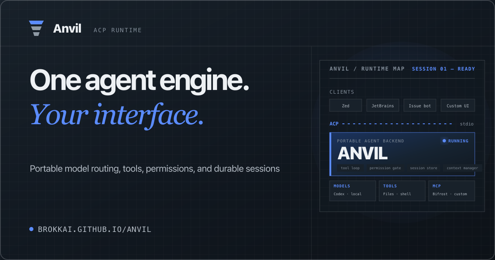

<h1 align="center">Anvil</h1>

<p align="center">
  <a href="https://anvil.brokk.ai/">
    
  </a>
</p>

<p align="center">
  <a href="https://github.com/BrokkAi/anvil/actions/workflows/ci.yml"></a>
  <a href="https://github.com/BrokkAi/anvil/releases/latest"></a>
  <a href="https://crates.io/crates/brokk-anvil"></a>
  <a href="LICENSE"></a>
</p>

<p align="center">
  <a href="#install-and-evaluate">Quickstart</a> ·
  <a href="https://anvil.brokk.ai/">Documentation</a> ·
  <a href="https://anvil.brokk.ai/evaluate-anvil/">Ten-minute evaluation</a> ·
  <a href="https://discord.gg/geYkWUeH">Discord</a>
</p>

Anvil is a Rust [Agent Client Protocol](https://agentclientprotocol.com/) server: one reusable agent engine for editors, bots, TUIs, and internal tools.

It is intentionally **just the ACP server**. Anvil owns model routing, the tool loop, permission enforcement, sessions, context compaction, sandboxing, and MCP integration. The ACP client owns the user experience.

```text
ACP client              stdio / JSON-RPC              Anvil
----------              ----------------              -----
Zed        ----------------------------------------->  agent loop
JetBrains   --------------------------------------->  model routing
issue bot   --------------------------------------->  permission gate
custom TUI  --------------------------------------->  tools + sessions
```

## Why Anvil

- **One engine, many frontends.** Reuse the same execution semantics from a supported editor or any ACP-over-stdio client.
- **Model routing built in.** Connect Codex/ChatGPT, Bedrock, Ollama, ds4, DeepSeek, Kimi, OpenAI-compatible providers, or OpenRouter.
- **Real agent tooling.** Filesystem and shell tools, managed Bifrost code intelligence, MCP servers, skills, plugins, and subagents.
- **Explicit safety boundaries.** Clients choose permission behavior while Anvil applies permission gates, workspace path checks, and the configured sandbox strategy.
- **Persistent work.** Load and resume sessions with durable history, usage reporting, and context compaction.

## Install and Evaluate

Install the released native binary through [uv](https://docs.astral.sh/uv/),
with no Rust toolchain required:

```bash
uv tool install brokk-anvil
anvil --version

# later
uv tool upgrade brokk-anvil
uv tool uninstall brokk-anvil
```

The Python package version pins the matching GitHub release. On first run it
downloads the native archive for macOS, Linux glibc, Windows, or
Android/Termux, verifies the published SHA-256 sidecar, and caches the binary.
See the [installation guide](https://anvil.brokk.ai/install/#uv) for exact
version pins, cache paths, and unsupported-platform behavior.

Or install with Homebrew on macOS (Apple Silicon and Intel) or Linux (x86-64
and ARM64 glibc):

```bash
brew install brokkai/tap/anvil
anvil --version
```

Or install through npm on any supported platform (macOS, Linux glibc, Windows, Android/Termux) — the package installs the released native binary, no Rust toolchain needed:

```bash
npm install -g @brokkai/anvil
anvil --version

# or run one-shot without installing
npx -y @brokkai/anvil --version
```

Or install the latest checksum-verified release on macOS, Linux, WSL, or Android/Termux:

```bash
curl -fsSL https://raw.githubusercontent.com/BrokkAi/anvil/refs/heads/master/install.sh | bash
anvil --version
```

To review the installer before running it, download `install.sh`, inspect it, then run it with `bash`. You can also download an archive from [GitHub Releases](https://github.com/BrokkAi/anvil/releases/latest), or install from crates.io:

```bash
rustup target add wasm32-wasip2
cargo install brokk-anvil --locked --force
anvil --version
```

Running `anvil` directly starts a stdio JSON-RPC server; use it through an ACP client. Continue with the [installation guide](https://anvil.brokk.ai/install/) or the reproducible [ten-minute evaluation](https://anvil.brokk.ai/evaluate-anvil/).

For scripts, CI jobs, and Makefiles, `anvil --print` runs one prompt headlessly with a built-in ACP client and exits — no external client required:

```bash
anvil -p "summarize the failing test"       # prompt as an argument
echo "fix this test" | anvil -p             # or on stdin (also: anvil -p -)
anvil -p "…" --output-format json           # one JSON object at exit
anvil -p "…" --output-format stream-json    # newline-delimited records, result last
anvil -p "…" --permission-mode yolo         # manual (default) | auto | yolo
anvil -p "…" --cwd /path/to/repo --model "codex::gpt-5-codex+high"
anvil -p "…" --resume SESSION_ID            # continue an existing session
```

Headless runs never block on a human: `manual` rejects every permission request but still honors agent-side approvals that never reach the client (`read`, `search`, and `fetch`; sandboxed shell commands on the conservative read-only safelist; and remembered repo-scoped **Always allow** grants); `auto` accepts edit/delete/move but rejects shell execution; and `yolo` accepts everything. The final assistant message goes to stdout (`text`), or a machine-readable payload with `session_id`, `resumed`, `result`, `stop_reason`, `usage`, and `error` (`json` / `stream-json`); progress and diagnostics stay on stderr, and the exit code is non-zero on agent or transport failure ([#356](https://github.com/BrokkAi/anvil/issues/356)).

`anvil serve` (included in all official binaries; source builds can opt out with `cargo build --no-default-features --features wasm-sandbox`) starts the same runtime as an HTTP daemon on a loopback listener (default `127.0.0.1:26845`), exposing versioned REST endpoints for session lifecycle, model discovery, the tool catalog, and asynchronous prompt runs with Server-Sent-Event streaming and cancellation (`/health`, `/v1/models`, `/v1/tools`, `/v1/sessions`, `/v1/runs`). The daemon supports bearer-token authentication (required for non-loopback binding), server-enforced workspace roots, and interactive permission approval endpoints. The wire contract is versioned and checked in under [`openapi/`](openapi/) (OpenAPI document, SSE event schema, and compatibility policy), with a black-box conformance suite holding the implementation to it; generated SDKs are under active development ([#315](https://github.com/BrokkAi/anvil/issues/315)).

Configure a supported ACP client directly from the installed binary:

```bash
anvil install zed
anvil install jetbrains
anvil install neovim --plugin codecompanion
```

## Supported Clients

- [Zed](https://anvil.brokk.ai/zed/), [JetBrains](https://anvil.brokk.ai/jetbrains/), and [Neovim](https://anvil.brokk.ai/neovim/) have direct installers and verified configuration shapes.
- [Other ACP clients](https://anvil.brokk.ai/other-acp-clients/) can launch Anvil as a custom stdio agent.
- The [client-building guide](https://anvil.brokk.ai/build-acp-client/) and `examples/` show issue triage, review, and issue-drafting automations.

## Documentation and Development

The [Anvil documentation](https://anvil.brokk.ai/) is the canonical user reference for providers, commands, tools, permissions, sessions, extensibility, and trust boundaries.

See [CONTRIBUTING.md](CONTRIBUTING.md) for source development, runtime invariants, tests, dependency-license policy, pull requests, and releases.

## License

Anvil is licensed under `LGPL-3.0-only`. See the practical [License and Use Cases](https://anvil.brokk.ai/license-use-cases/) guide, the controlling [LICENSE](LICENSE), and [third-party notices](https://anvil.brokk.ai/third-party-notices/).
